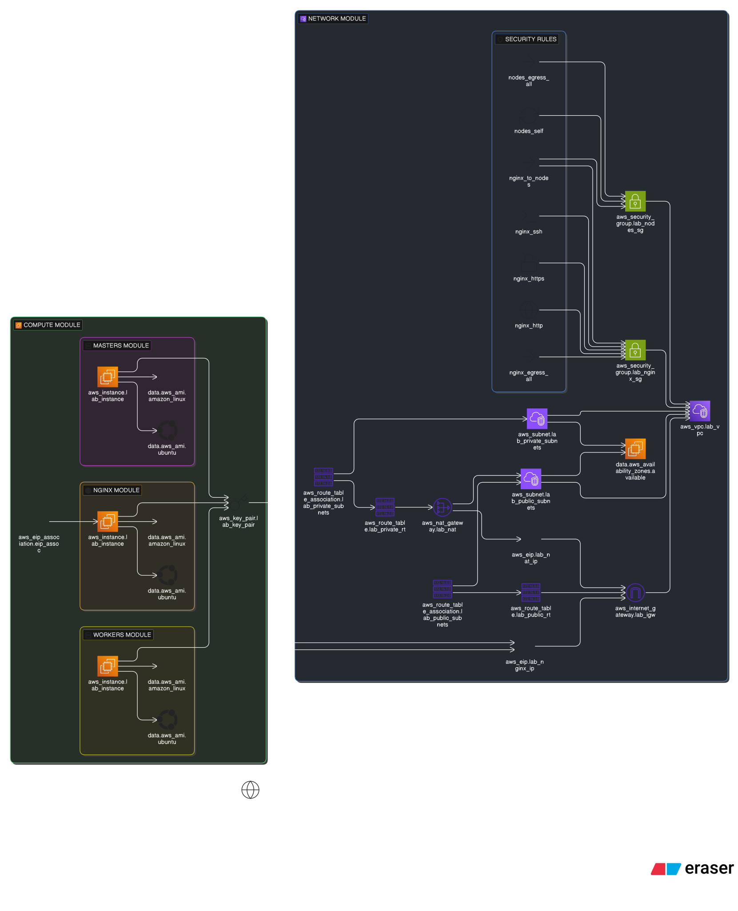

# KubaForm

Problem Statement:
- EKS is pricy
- EKS is overwhelming
- EKS PRICING IS OVERWHELMING

- To manage simple kubernetes workflow we just need a small cluster to be created in which our nodes could run!

Presenting a templatized kubernetes deployment which auto-configures EC2 instances as master and worker nodes where kubeadm and other tools are automatically installed...

Need to run a quick workflow? Just `terraform apply` and you're ready to go.

Done with your learning for the day? Want to save AWS costs? `terraform destroy` and it will de-provision everything.

No need to setup your own rig, or learn EKS... Just simply work with pre-configured tools (available as part of [User Data Scripts](./user_data/)) you need to explore the world of kubernetes.

The current configuration deploys the following architecture in AWS:


Now to provision these components the following terraform resources were defined in each module (generated with `terraform graph` rendered by `eraser.io`):



## Prerequisites
1. AWS CLI with configured ACCESS_KEY_ID and SECRET_ACCESS_KEY
2. Terraform (>= v1.14)
3. (Optional) Namecheap credentials if you want the separate DNS stack to manage domain records.

> If you don't have access to the API Key. Just add 50$ to your funds and they will let you enable API access. They tell you you can redeem it back but I didn't found an option in their portal to do so :)

## Quick Start

Kubaform ships with its own defaults based on industry best practices, ensuring HA while keeping costs minimal.

### Provision the Lab Core

To get started with the lab core:

```bash
cd kubaform
terraform init
terraform apply
```

Review the plan, type `yes`, and Terraform will provision the lab (ETA: 3 mins).

### (Optional) Provision DNS Stack

This stack manages DNS mappings for the `kubaform` lab as a separate Terraform workspace to keep Namecheap DNS automation isolated from the main lab stack. It reads `lab_ip` from the main stack state before applying and fails early if the main stack is not provisioned.

1. Run the main stack first as above.

2. Switch to the domain stack folder:

```bash
cd kubaform/domain
terraform init
terraform apply -var-file=secrets.tfvars
```

The domain stack currently supports `namecheap`. Set `domain_provider` to "namecheap" and supply the appropriate credentials.

Example variables file:

```hcl
root_domain = "example.com"
list_of_subdomains = ["lab"]
domain_provider = "namecheap"
namecheap_user_name = "YOUR_NAMECHEAP_USERNAME"
namecheap_api_user = "YOUR_NAMECHEAP_API_USER"
namecheap_api_key = "YOUR_NAMECHEAP_API_KEY"
```

> The domain stack reads `lab_ip` directly from the main stack state using Terraform remote state. If the output is missing, the domain stack will fail and prompt you to run the main stack first.
>
> This automation is intended for Namecheap as it provides an official Terraform provider. If you're using another domain registrar like Cloudflare or GoDaddy, manually update the `lab_ip` with an A record to the subdomain of your choice. Be mindful to update the `kubeapi_public_hostname` in the lab stack's variables to match the subdomain you're mapping.

For detailed setup and configuration, see the [documentation](./docs/).

## Destroy

If you want to save costs, you can always de-provision resources after you're done playing around using:

```bash
terraform destroy # In the root directory
```

This will automatically remove all associations and de-provision all resources that were created with `apply`.

> Although it is not needed to run the stacks in reverse order, it is recommended to ensure proper de-provisioning.

## Configuration

I get it, we all need customizations. I have tried my best to provide as much abstraction as possible while making sure not to overwhelm you.

> Note: While you cannot customize the architecture (with the current design), you can tweak more or fewer instances, subnets, storage volumes, and instance classes.

To know more, check out the available configuration in [variables.tf](./variables.tf).

## Documentation

Find detailed documentation [here](./docs/), including bootstrap flow, cluster access, TLS setup, app deployment, SSH key pairs, backend configuration, and design decisions.

## Contribution

I would love to see more ideas implemented into this design.

Currently let's keep it `terraform` only. I know there are customizations we can think out of terraform's custom logic. But I would rather not expand to have different runtimes just yet. I have a few other things planned:
- Support for OpenTofu
- Implement other backends (for now it only has S3 as a backend and state locking)
- Setup CI/CD for drift detection and auto-apply (Use OIDC → assume IAM role - to authenticate terraform to AWS)
- Support for [setting up lab internals using Terraform instead of User Data scripts](https://registry.terraform.io/modules/terraform-module/release/helm/latest).